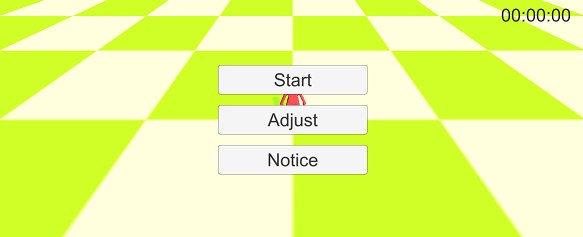
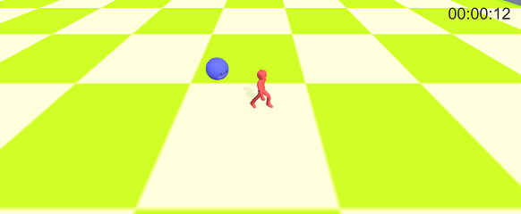

# SlimeGauge
Unityを使ってみたかっただけ

- 詳しい設計は「doc/SlimeGauge.md」を参照  
  ※VScodeにmarkdown-preview-enhancedを入れて記載  

- キーボードの↑キー or マウスクリックでキャラクタを操作して、スライムから逃げ続けられた時間を競うゲーム  
- キャラクタ操作はスクリプトにして自動操作＆改造ができるようにしようと思っていたが止めました  
  ※めんどくさくなった・・・  

  

  
