@import "doc.less"

# SlimeGauge

## 概要設計

### 方針
- このアプリの目的は「作者の自己満足(Unityを使ってみたいだけ)」
- このアプリの内容は「スライムと鬼ごっこをする」こと
  - プレイヤーが逃げる役
  - スライムが追いかける役

### プレイヤーについて
- 操作は自動操縦
  - 自動操縦のアルゴリズムの改造が可能

### スライムについて
- 時間が経過すると増える(最大10匹)

### メモ
- 初期には実装しないが、余裕があったらのちのち検討してみたい仕様
  - 障害物の設置(初期のマップは何も物がない平面)
  - 立体起動(初期はx,yの2次元移動、余裕ができたらzも追加してジャンプができるようにする)
  - 性格(スライムの個体毎に追いかけるアルゴリズムを変更)
  - ステータス(プレイヤー、スライムの個体毎に速度、瞬発力、体力、スキル等を変えて個性を持たせたい)
  - スライムの連携(スライムに指揮のスキルを持たせるか、協調性のパラメータを持たせるか)

## 外部設計

### ワークフロー

```plantuml
start
note right
   起動
end note
:初期化;
note right
   メニューを表示
   背景は鬼ごっこを行うフィールド
end note
repeat
   switch (ユーザー操作待ち)
   case (Startボタン)
      :メニューを非表示;
      group 鬼ごっこを行うモード
         :「鬼ごっこを行う」に記載;
      end group
      :メニューを表示;
   case (Adjustボタン)
      :調整画面を表示;
      group プレイヤーの行動を調整するモード
         :「プレイヤーの行動を調整」に記載;
      end group
      :調整画面を非表示;
   case (Noticeボタン)
      :お知らせを表示;
      group お知らせを閲覧するモード
         :「お知らせの閲覧」に記載;
      end group
      :お知らせを非表示;
   case (アプリ終了)
      stop
      note right
         終了
      end note
   endswitch
repeat while ()
```

### 鬼ごっこを行う

```plantuml
left to right direction
!define  Initial  初期化
Initial : ボタンを非表示
Initial : カウンタリセット
!define  Play     鬼ごっこ
Play : 時間経過
Play : プレイヤーが行動
Play : スライムが行動
!define  GameOver 後処理
GameOver : ボタンを表示
[*]      -->   Initial  : Startボタン
Initial  -->   Play     : 初期化完了
Play     -->   GameOver : 鬼ごっこ終了
GameOver -->   [*]      : 後処理完了
```

### プレイヤーの行動を調整

```plantuml
left to right direction
!define  Dialog   調整画面
Dialog : 行動アルゴリズムの変更
[*]      -->   Dialog   : Adjustボタン
Dialog   -->   [*]      : Closeボタン
```

### お知らせの閲覧

```plantuml
left to right direction
!define  Dialog   お知らせ画面
Dialog : アプリのバージョン
Dialog : アプリの更新履歴
Dialog : 著作権表記
[*]      -->   Dialog   : Noticeボタン
Dialog   -->   [*]      : Closeボタン
```

## 内部設計

### 機能構成

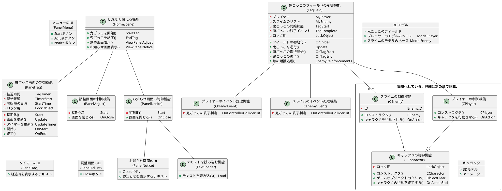

---

### UIを切り替える機能

#### 鬼ごっこを開始／鬼ごっこを終了

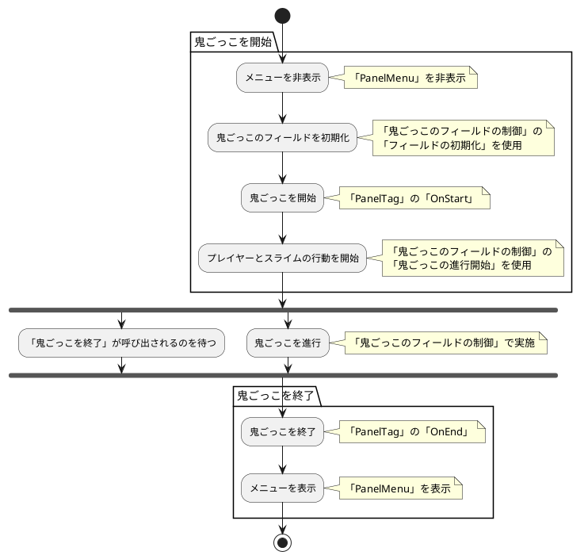

#### 調整画面表示

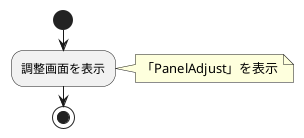

#### お知らせ画面表示

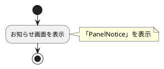

---

### 鬼ごっこ画面の制御機能

####  初期化

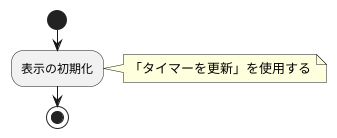

#### 画面を更新

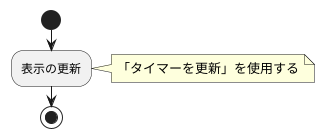

#### タイマーを更新

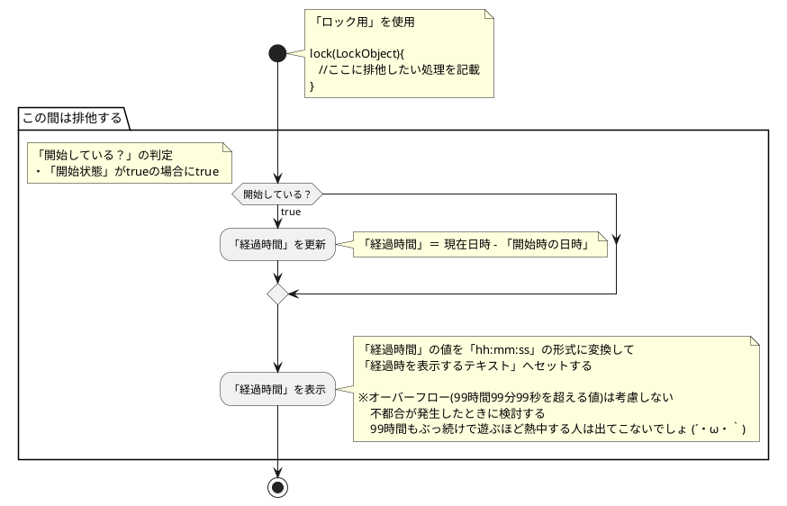

#### 開始

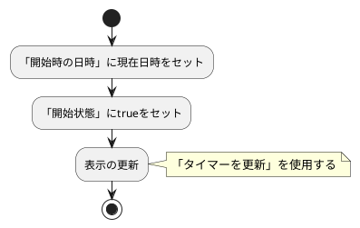

#### 終了

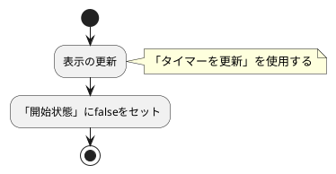

---

### 調整画面の制御機能

#### 初期化

<font color="red">良い方法が思いつかないので保留</font>

#### 画面を閉じる

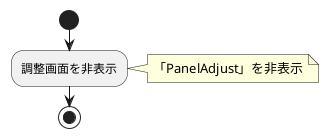

---

### お知らせ画面の制御機能

#### 初期化
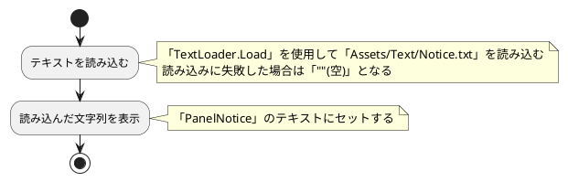

#### 画面を閉じる

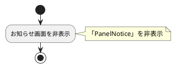

---

### 鬼ごっこのフィールドの制御機能

#### フィールドの初期化

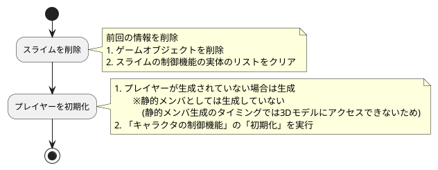

#### 鬼ごっこを進行


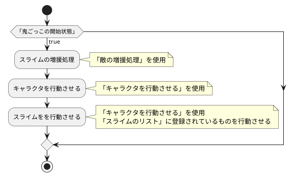

#### 鬼ごっこの進行開始

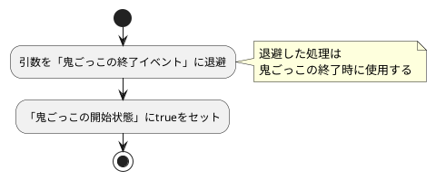

#### 鬼ごっこの終了

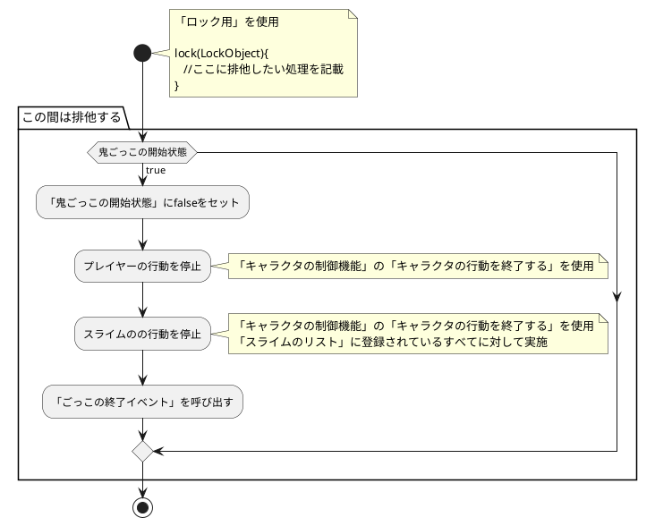

#### 敵の増援処理

```plantuml
@startuml
start
   if (「スライムのリスト」の数が10未満？) then (true)
      if (スライムの追加が必要？) then (true)
         note right
            「スライムの追加が必要？」の判定
            ・「スライムのリスト」の数 × 60 <= 「鬼ごっこ画面の制御機能」の「経過時間」を秒換算した値
         end note
         :スライムを出現させる;
         note right
            1. 「スライムの制御機能」を生成
            　　※IDは現在のスライムの数 + 1 とする
            2. 生成したスライムの「初期化」を実行
            3. 生成したスライムを「スライムのリスト」に追加
         end note
      endif
   endif
stop
@enduml
```

#### 鬼ごっこの終了判定

- プレイヤーのイベント処理機能
- スライムのイベント処理機能

```plantuml
@startuml
start
note right
   キャラクタ(プレイヤー、スライム)が
   他のオブジェクトに衝突したときに呼び出される
end note
if (鬼ごっこが終了した？) then (true)
   note right
      「鬼ごっこが終了した？」の判定

      ＜レイヤーのイベント処理機能＞
      ・スライムに衝突した時にtrueとする
      　※オブジェクトの名前に「slime」が含まれているかで判定

      ＜スライムのイベント処理機能＞
      ・プレイヤーに衝突した時にtrueとする
      　※オブジェクトの名前に「chara」が含まれているかで判定
   end note
   :鬼ごっこの終了;
   note right
      「鬼ごっこのフィールドの制御機能」の
      「鬼ごっこの終了」を使用
   end note
endif
stop
@enduml
```

## 内部設計(キャラクタの制御)

### キャラクタの状態

```plantuml
@startuml
!define  Wait  待機中
!define  Walk  歩行中
Wait : ※StateWait
Walk : ※StateWalk
[*]   -->   Wait
Wait  ->    Walk  : StateWalk
Walk  ->    Wait  : StateWalk以外
@enduml
```

### 機能構成

```plantuml
@startuml
class "キャラクタの制御機能\n(CCharactor)" as CCharactor{
   - 3Dモデル\t\t\t\t\t\tMyModel
   - アニメーター\t\t\t\t\tMyAnime
   - キャラクタコントロール\t\tMyCtrl
   - 移動速度\t\t\t\t\t\tMoveSpeed
   - 開始位置\t\t\t\t\t\tStartingPosition
   - 開始日時\t\t\t\t\t\tStartTime
   - 移動する位置\t\t\t\t\tDestination
   - ロック用\t\t\t\t\t\tLockObject
   + コンストラクタ()\t\t\t\tCCharactor
   + ゲームオブジェクトのクリア()\tObjectClear
   + 初期化()\t\t\t\t\t\tOnInitial
   + キャラクタを行動させる()\t\tOnAction
   + キャラクタの行動を終了する()\tOnActionEnd
   + 同一の位置にいるか？()\t\t\tIsSamePosition
   + キャラクタの位置を取得()\t\tGetPosition
   + 移動する位置を設定()\t\t\tSetDestination
   + キャラクタを停止する()\t\t\tStop
   + 設定した位置へ移動する()\t\tMove
   - 状態の取得()\t\t\t\t\tGetState
   - 状態の設定()\t\t\t\t\tSetState
   - 進行方向を取得()\t\t\t\tGetDirection
   + キー操作()\t\t\t\t\tKeyOperation
}
note left
   以下は継承先でオーバーライドする
   ・移動速度
   ・開始位置
end note
object "フィールドの設定値" as FieldConfig{
   - フィールドのサイズ
   - 同一の位置にいると判定する距離
}
class "プレイヤーの制御機能\n(CPlayer)" as CPlayer{
   - 移動速度\t\t\t\t\tMoveSpeed
   - 開始位置\t\t\t\t\tStartingPosition
   + コンストラクタ()\t\t\tCPlayer
   + キャラクタを行動させる()\tOnAction
}
class "スライムの制御機能\n(CEnemy)" as CEnemy{
   - ID\t\t\t\t\t\tEnemyID
   - 移動速度\t\t\t\t\tMoveSpeed
   - 開始位置\t\t\t\t\tStartingPosition
   + コンストラクタ()\t\t\tCEnemy
   + キャラクタを行動させる()\tOnAction
}
CPlayer     --|>  CCharactor
CEnemy      --|>  CCharactor
CCharactor  -     FieldConfig
@enduml
```

---

#### 機能構成(概要＆コンストラクタ)

```plantuml
@startuml
!define  OBJ_FUNC <<F,lavender)>>
!define  OBJ_DATA <<D,orchid)>>
class "キャラクタのベース" as BaseModel OBJ_DATA{
   + 3Dモデル
   + アニメーター
   + キャラクタコントロール
}
package "キャラクタの制御機能\n(CCharactor)"{
   class "コンストラクタ\n(CCharactor)" as CCharactor OBJ_FUNC{
   }
   class "鬼ごっこの進行用の処理" as PackTag OBJ_FUNC{
      + ゲームオブジェクトのクリア\t\tObjectClear
      + 初期化\t\t\t\t\t\tOnInitial
      + キャラクタを行動させる\t\tOnAction
      + キャラクタの行動を終了する\t\tOnActionEnd
   }
   class "キャラクタの行動用の処理" as PackMove OBJ_FUNC{
      + 同一の位置にいるか？\t\tIsSamePosition
      + キャラクタを停止する\t\tStop
      + 設定した位置へ移動する\tMove
      + キー操作\t\t\t\t\tKeyOperation
   }
   class "情報取得／設定用の処理" as PackState OBJ_FUNC{
      + キャラクタの位置を取得\tGetPosition
      + 移動する位置を設定\t\tSetDestination
      + 状態の取得\t\t\t\tGetState
      + 状態の設定\t\t\t\tSetState
      + 進行方向を取得\t\t\tGetDirection
   }
   class "キャラクタ" as Model OBJ_DATA{
      + 3Dモデル\t\t\t\t\tMyModel
      + アニメーター\t\t\t\tMyAnime
      + キャラクタコントロール\tMyCtrl
      + 開始日時\t\t\t\t\tStartTime
      + 移動する位置\t\t\t\tDestination
   }
   class "キャラクタの設定" as Config OBJ_DATA{
      - 移動速度\t\tMoveSpeed
      - 開始位置\t\tStartingPosition
   }
   class "フィールドの設定" as FieldConfig OBJ_DATA{
      - フィールドのサイズ\t\t\t\tFieldH
      - フィールドのサイズ\t\t\t\tFieldV
      - 同一の位置にいると判定する距離\t\tContactDistance
   }
   class "ロック用\n(LockObject)" as LockObject OBJ_DATA{
   }
}
BaseModel   -->   CCharactor
CCharactor  -->   Model       : 初期設定\n初期化子
CCharactor  -->   Config      : 初期設子\n(派生クラスで設定)
CCharactor  -->   FieldConfig : 初期化子
CCharactor  -->   LockObject  : 初期化子

Model       <-->  PackState
FieldConfig -->   PackState

Model       <--   PackMove
Config      -->   PackMove
LockObject  <--   PackMove
PackMove    <->   PackState

Model       <---  PackTag
Config      --->  PackTag
PackState   <-->  PackTag
PackMove    <-->  PackTag
@enduml
```

---

#### 機能構成(鬼ごっこの進行用の処理)

- 「情報取得／設定用の処理」が作用するオブジェクトは省略
- 「キャラクタの行動用の処理」が作用するオブジェクトは省略

```plantuml
@startuml
!define  COLOR_SIMPLE   #FFFFFF
!define  OBJ_FUNC <<F,lavender)>>
!define  OBJ_DATA <<D,orchid)>>
package "キャラクタの制御機能\n(CCharactor)"{
   package "キャラクタ"{
      class "3Dモデル\n(MyModel)" as MyModel OBJ_DATA{
         + 位置\t\tposition
         + 向き\t\trotation
      }
      class "開始日時\n(StartTime)" as StartTime OBJ_DATA{
      }
   }
   package "キャラクタの設定"{
      class "開始位置\n(StartingPositio)" as StartingPositio OBJ_DATA{
      }
   }
   package "鬼ごっこの進行用の処理"{
      class "ゲームオブジェクトのクリア\n(ObjectClear)" as ObjectClear OBJ_FUNC OBJ_FUNC{
      }
      class "初期化\n(OnInitial)" as OnInitial OBJ_FUNC OBJ_FUNC{
      }
      class "キャラクタを行動させる\n(OnAction)" as OnAction OBJ_FUNC OBJ_FUNC{
      }
      class "キャラクタの行動を終了する\n(OnActionEnd)" as OnActionEnd OBJ_FUNC OBJ_FUNC{
      }
   }
   package "キャラクタの行動用の処理"{
      class "キャラクタを停止する\n(Stop)" as Stop OBJ_FUNC COLOR_SIMPLE{
      }
      class "設定した位置へ移動する\n(Stop)" as Move OBJ_FUNC COLOR_SIMPLE{
      }
   }
   package "情報取得／設定用の処理"{
      class "移動する位置を設定\n(SetDestination)" as SetDestination OBJ_FUNC COLOR_SIMPLE{
      }
      class "状態の設定\n(SetState)" as SetState OBJ_FUNC COLOR_SIMPLE{
      }
   }
}
MyModel           <--   ObjectClear       : 削除

MyModel           <--   OnInitial         : 位置
StartTime         <--   OnInitial         : 設定
StartingPositio   -->   OnInitial
OnInitial         -->   SetState          : 状態
OnInitial         -->   SetDestination    : 位置

OnAction          --    Move
StartTime         -->   OnAction

OnActionEnd       --    Stop
@enduml
```

---

#### 機能構成(キャラクタの行動用の処理)

- 「情報取得／設定用の処理」が作用するオブジェクトは省略
- 「設定した位置へ移動する」は分けて記載
  - 分けて記載した図は、「設定した位置へ移動する」以外の処理が作用するオブジェクトは省略

```plantuml
@startuml
!define  COLOR_SIMPLE   #FFFFFF
!define  OBJ_FUNC <<F,lavender)>>
!define  OBJ_DATA <<D,orchid)>>
package "キャラクタの制御機能\n(CCharactor)"{
   package "キャラクタ"{
      class "キャラクタコントロール\n(MyAnime)" as MyCtrl OBJ_DATA{
      }
   }
   package "フィールドの設定"{
      class "同一の位置にいると判定する距離\n(ContactDistance)" as ContactDistance OBJ_DATA{
      }
   }
   class "ロック用\n(LockObject)" as LockObject OBJ_DATA{
   }
   package "キャラクタの行動用の処理"{
      class "同一の位置にいるか？\n(IsSamePosition)" as IsSamePosition OBJ_FUNC{
      }
      class "キャラクタを停止する\n(Stop)" as Stop OBJ_FUNC{
      }
      class "キー操作\n(KeyOperation)" as KeyOperation OBJ_FUNC{
      }
   }
   package "情報取得／設定用の処理"{
      class "キャラクタの位置を取得\n(GetPosition)" as GetPosition OBJ_FUNC COLOR_SIMPLE{
      }
      class "移動する位置を設定\n(SetDestination)" as SetDestination OBJ_FUNC COLOR_SIMPLE{
      }
      class "状態の取得\n(GetState)" as GetState OBJ_FUNC COLOR_SIMPLE{
      }
      class "状態の設定\n(SetState)" as SetState OBJ_FUNC COLOR_SIMPLE{
      }
   }
}
class "比較したい位置" as InPosition OBJ_DATA{
}
ContactDistance   -->   IsSamePosition    : 判定結果
IsSamePosition    <--   GetPosition       : 位置
IsSamePosition    <--   InPosition

MyCtrl            <--   Stop              : 加速度
Stop              <--   GetState          : 状態
Stop              -->   SetState          : 状態
Stop              <--   GetPosition       : 位置
Stop              -->   SetDestination    : 位置
LockObject        <-    Stop              : 使用

KeyOperation      <--   GetPosition       : 位置
KeyOperation      -->   SetDestination    : 位置
@enduml
```

```plantuml
@startuml
!define  COLOR_SIMPLE   #FFFFFF
!define  OBJ_FUNC <<F,lavender)>>
!define  OBJ_DATA <<D,orchid)>>
package "キャラクタの制御機能\n(CCharactor)"{
   package "キャラクタ"{
      class "3Dモデル\n(MyModel)" as MyModel OBJ_DATA{
         + 位置\t\tposition
         + 向き\t\trotation
      }
      class "キャラクタコントロール\n(MyAnime)" as MyCtrl OBJ_DATA{
      }
   }
   package "キャラクタの設定"{
      class "移動速度\n(MoveSpeed)" as MoveSpeed OBJ_DATA{
      }
   }
   class "ロック用\n(LockObject)" as LockObject OBJ_DATA{
   }
   package "キャラクタの行動用の処理"{
      class "同一の位置にいるか？\n(IsSamePosition)" as IsSamePosition OBJ_FUNC COLOR_SIMPLE{
      }
      class "キャラクタを停止する\n(Stop)" as Stop OBJ_FUNC COLOR_SIMPLE{
      }
      class "設定した位置へ移動する\n(Stop)" as Move OBJ_FUNC{
      }
   }
   package "情報取得／設定用の処理"{
      class "状態の取得\n(GetState)" as GetState OBJ_FUNC COLOR_SIMPLE{
       }
      class "状態の設定\n(SetState)" as SetState OBJ_FUNC COLOR_SIMPLE{
      }
      class "進行方向を取得\n(GetDirection)" as GetDirection OBJ_FUNC COLOR_SIMPLE{
      }
   }
}
MyModel           <--   Move              : 向き
MyCtrl            <--   Move              : 加速度
MoveSpeed         -->   Move
Move              <--   GetDirection      : 進行方向
Move              <--   GetState          : 状態
Move              -->   SetState          : 状態
Move              <-    IsSamePosition    : 判定結果
Stop              -     Move
LockObject        <--   Move              : 使用
@enduml
```

---

#### 機能構成(情報取得／設定用の処理)

```plantuml
@startuml
!define  OBJ_FUNC <<F,lavender)>>
!define  OBJ_DATA <<D,orchid)>>
package "キャラクタの制御機能\n(CCharactor)"{
   package "キャラクタ"{
      class "3Dモデル\n(MyModel)" as MyModel OBJ_DATA{
         + 位置\t\tposition
         + 向き\t\trotation
      }
      class "アニメーター\n(MyAnime)" as MyAnime OBJ_DATA{
         - 状態\t\tState
      }
      class "移動する位置\n(Destination)" as Destination OBJ_DATA{
      }
   }
   package "フィールドの設定"{
      class "フィールドのサイズ" as FieldHV OBJ_DATA{
         - フィールドのサイズ\t\tFieldH
         - フィールドのサイズ\t\tFieldV
      }
   }
   package "情報取得／設定用の処理"{
      class "キャラクタの位置を取得\n(GetPosition)" as GetPosition OBJ_FUNC{
      }
      class "移動する位置を設定\n(SetDestination)" as SetDestination OBJ_FUNC{
      }
      class "状態の取得\n(GetState)" as GetState OBJ_FUNC{
      }
      class "状態の設定\n(SetState)" as SetState OBJ_FUNC{
      }
      class "進行方向を取得\n(GetDirection)" as GetDirection OBJ_FUNC{
      }
   }
}
class "キャラクタの位置" as OutPosition OBJ_DATA{
}
class "状態" as InState OBJ_DATA{
}
class "状態" as OutState OBJ_DATA{
}
class "移動させたい位置" as InDist OBJ_DATA{
}
class "進行方向" as OutDirection OBJ_DATA{
}
MyModel        -->   GetPosition    : 位置
GetPosition    -->   OutPosition

MyAnime        -->   GetState       : 状態
GetState       -->   OutState

MyAnime        <--   SetState       : 状態
SetState       <--   InState

Destination    <--   SetDestination
FieldHV        -->   SetDestination : 移動可能な範囲
SetDestination <--   InDist

Destination    -->   GetDirection
GetPosition    ->    GetDirection   : 位置
GetDirection   -->   OutDirection
@enduml
```

---

### キャラクタの制御機能

#### コンストラクタ

- 以下の「コンストラクタ」の処理も記載
  - プレイヤーの制御機能
  - スライムの制御機能

```plantuml
@startuml
start
package "「スライムの制御機能」の場合に実施する処理"{
   :キャラクタのオブジェクトのクローンを生成;
   note right
      基底クラスには生成したクローンを渡す
   end note
   :IDを初期化;
}
package "「キャラクタの制御機能」の「コンストラクタ」"{
   :キャラクタを初期化;
   note right
      「3Dモデル」に引数のオブジェクトをセット
      「3Dモデル」を表示する
      「アニメーター」に「3Dモデル」のアニメータを設定
      「キャラクタコントロール」に「3Dモデル」のキャラクタコントロールを設定
   end note
}
stop
@enduml
```

---

#### ゲームオブジェクトのクリア

```plantuml
@startuml
start
:「3Dモデル」を削除;
note right
   UnityEngine.Object.Destroy(「3Dモデル」) 
end note
stop
@enduml
```

#### 初期化

```plantuml
@startuml
start
:キャラクタの位置を開始位置に設定;
note right
   「3Dモデル」の位置に「開始位置」をセット
end note
:状態を待機中に設定;
note right
   「状態の設定」を使用
end note
:「移動する位置」に「開始位置」を設定;
note right
   「移動する位置を設定」を使用
end note
:「開始日時」に現在日時を設定;
stop
@enduml
```

#### キャラクタを行動させる

- 以下の「キャラクタを行動させる」の処理も記載
  - プレイヤーの制御機能
  - スライムの制御機能

```plantuml
@startuml
start
package  "派生クラスの処理"{
   :行動アルゴリズム;
   note right
      詳細は以下の章を参照
      ・プレイヤーの行動アルゴリズム
      ・スライムの行動アルゴリズム
   end note
}
package "「キャラクタの制御機能」の「キャラクタを行動させる」処理"{
   if (開始から1秒以上経過している？) then (true)
      note right
         「開始日時」と現在日時を比較して判定する
      end note
      :設定した位置へ移動する;
      note right
         「設定した位置へ移動する」を使用
      end note
   endif
}
stop
@enduml
```

#### キャラクタの行動を終了する

```plantuml
@startuml
start
:キャラクタを停止する;
note right
   「キャラクタを停止する」を使用
end note
stop
@enduml
```

---

#### 同一の位置にいるか？

```plantuml
@startuml
start
:入力された位置とキャラクタの現在位置の距離を算出;
note right
   (キャラクタの現在位置 - 入力された位置).magnitude  
end note
:算出した距離が「「同一の位置にいると判定する距離」未満かを判定;
stop
@enduml
```

#### キャラクタを停止する

```plantuml
@startuml
start
package "この間は排他する"{
   if (状態が待機中ではない？) then (true)
      note right
         「状態の取得」の結果が待機中ではない場合にtrue
      end note
      :キャラクタの加速度を0に設定;
      note right
         「キャラクタコントロール」のSimpleMove(Vector3.zero)を使用
         ※厳密には加速度0ではなく重力にみが働いている状態とする
      end note
      :キャラクタの状態を待機中に設定;
      note right
         「状態の設定」を使用
      end note
      :「移動する位置」を現在のキャラクタの位置に設定;
      note right
         「キャラクタの位置を取得」を使用
         「移動する位置を設定」を使用
      end note
   endif
}
stop
@enduml
```

#### 設定した位置へ移動する

```plantuml
@startuml
start
package "この間は排他する"{
   :移動が必要か？を判定する;
   note right
      移動が必要か？の判定
      ・「同一の位置にいるか？」に「移動する位置」を入力することで判定する
   end note
   if (移動が必要か？の結果) then (true)
      if (状態が歩行中ではない？) then (true)
         note right
            「状態の取得」の結果が歩行中ではない場合にtrue
         end note
         :キャラクタの状態を歩行中に設定;
         note right
            「状態の設定」を使用
         end note
      endif
      :キャラクタの向きを変更;
      note right
         「3Dモデル」のtransform.rotationに
         Quaternion.LookRotation(「進行方向を取得」で取得した値) をセットする
      end note
      :キャラクタの加速度を設定;
      note right
         「3Dモデル」のtransform.forward と「移動速度」の乗算結果を
         「キャラクタコントロール」のSimpleMove で設定する
      end note
   endif
}
if (移動が必要か？の結果) then (false)
   :キャラクタを停止する;
   note right
      「キャラクタを停止する」を使用
   end note
endif
stop
@enduml
```

#### キー操作

```plantuml
@startuml
start
if (方向キーが押されている？) then (true)
   :方向キーの竜力量＋現在の位置を「移動する位置」に設定;
else if (Enterキーが押されている？) then (true)
   :現在位置を「移動する位置」に設定;
else if (マウスがクリックされた？) then (true)
   :マウスのクリック位置を「移動する位置」に設定;
endif
stop
@enduml
```

---

#### キャラクタの位置を取得

```plantuml
@startuml
start
:「3Dモデル」の位置を取得;
note right
   transform.positionを使用
end note
stop
@enduml
```

#### 移動する位置を設定

```plantuml
@startuml
start
if (移動させたい位置が範囲外か？) then (true)
   :移動させたい位置を範囲内に丸める;
   note right
      フィールドのサイズ ～　-フィールドのサイズ が範囲
      x軸が水平(H)、z軸が垂直(V)とする
   end note
endif
:「移動する位置」にセット;
stop
@enduml
```

#### 状態の取得

```plantuml
@startuml
start
:「アニメーター」の状態を取得;
note right
   Stateの値が状態となる
   ※StateはUnityのGUI操作で追加した変数
end note
stop
@enduml
```

#### 状態の設定

```plantuml
@startuml
start
:「アニメーター」に状態をセット;
note right
   Stateへセット
   ※StateはUnityのGUI操作で追加した変数
end note
stop
@enduml
```

#### 進行方向を取得

```plantuml
@startuml
start
:進行方向を算出;
note right
   キャラクタの位置 - 「移動する位置」 が
   キャラクタの位置から「移動する位置」までの進行方向となる
end note
stop
@enduml
```

## プレイヤーの行動アルゴリズム

<font color="red">まずは「キー操作」で行動させる</font>

## スライムの行動アルゴリズム

- IDによって行動が異なる

|ID|行動|
|-|-|
|1|プレイヤーの現座位置を目指して移動|
|2|プレイヤーの現座位置+(3,0)を目指して移動|
|3|プレイヤーの現座位置+(0,3)を目指して移動|
|4|プレイヤーの現座位置+(-3,0)を目指して移動|
|5|プレイヤーの現座位置+(0,-3)を目指して移動|
|6|プレイヤーの現座位置を目指して移動<br>行動範囲は水平:-50～0、垂直0～50|
|7|プレイヤーの現座位置を目指して移動<br>行動範囲は水平:0～50、垂直0～50|
|8|プレイヤーの現座位置を目指して移動<br>行動範囲は水平:0～50、垂直-50～0|
|9|プレイヤーの現座位置を目指して移動<br>行動範囲は水平:-50～0、垂直-50～0|
|10|プレイヤーの現座位置を目指して移動<br>行動範囲は水平:-25～25、垂直-25～25|

## 調整値

|内容|値|変数名|
|-|-|-|
|フィールドのサイズ<br>・水平(x方向)：-50～50<br>・垂直(z方向)：-50～50|50.0|FieldH<br>FieldV|
|同一の位置にいると判定する距離|0.1|ContactDistance|
|キャラクタの初期位置|プレイヤー：0,0,0<br>スライム　：30,0,30|StartingPosition|
|キャラクタの移動速度|プレイヤー：10.0<br>スライム　：8.0|MoveSpeed|
||||
